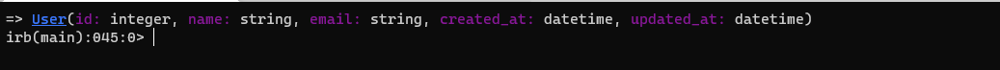
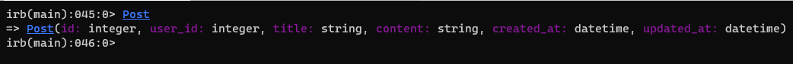

# Micro-reddit
This project consists of creating a light weight version of reddit called micro-reddit with emphasis in the model part of Ruby on Rails, data modeling and testing our active record knowledge or ORM('object relational mapping')

**User table**

**Post table**

**Comment table**

## This project has the following features:

- User table
- Post table
- Comment table

## Built With

- Ruby on Rails

## Getting Started

### Prerequisites

If you intend to download the project, you will need to have Ruby already installed on your machine. For more information on how to install Ruby, follow [this link.](https://www.ruby-lang.org/en/downloads/)

### Installation instructions

Follow along the steps below to get a copy on your local machine.

- Navigate to the directory where you want this project to live and then clone it `git clone git@github.com:helciodev/micro-reddit-repo.git`
- Navigate to the `micro-reddit-repo` directory
- install the gem package with `bundle install`
- Migrate the database on your local machine with `rails db:migrate`
- Open the console ($ rails console)

**To get your own copy of our project clone the repository to your local machine.**

[repository](https://github.com/helciodev/micro-reddit-repo)

## Authors

😎 **Helcio André**

- GitHub: [@helciodev](https://github.com/helciodev)
- Twitter: [@helcio_bruno](https://twitter.com/helcio_bruno)
- Linkedin: [Helcio Andre](https://www.linkedin.com/in/helcio-andre/)

👤 **Ray King**

- GitHub [rayKing12](GitHub.com/rayking12)
- Linkedin: [Ray King](https://www.linkedin.com/in/king-ray-514b89133/)

## 🤝 Contributing

Contributions, issues and feature requests are welcome!

Feel free to check the [issues page](https://github.com/helciodev/micro-reddit-repo/issues).

## Show your support

Give a ⭐️ if you like this project!

## 📝 License

This project is [MIT](./LICENSE) licensed.
